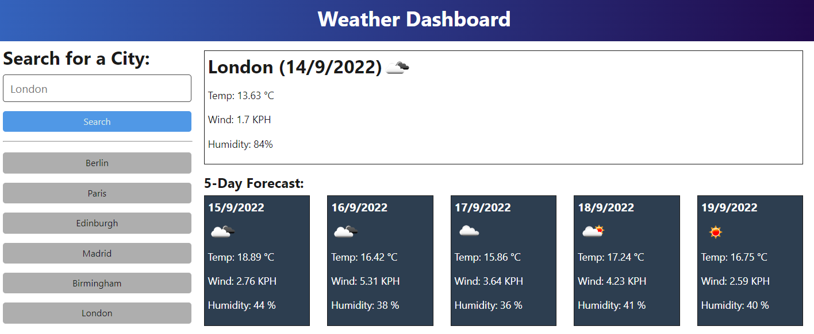
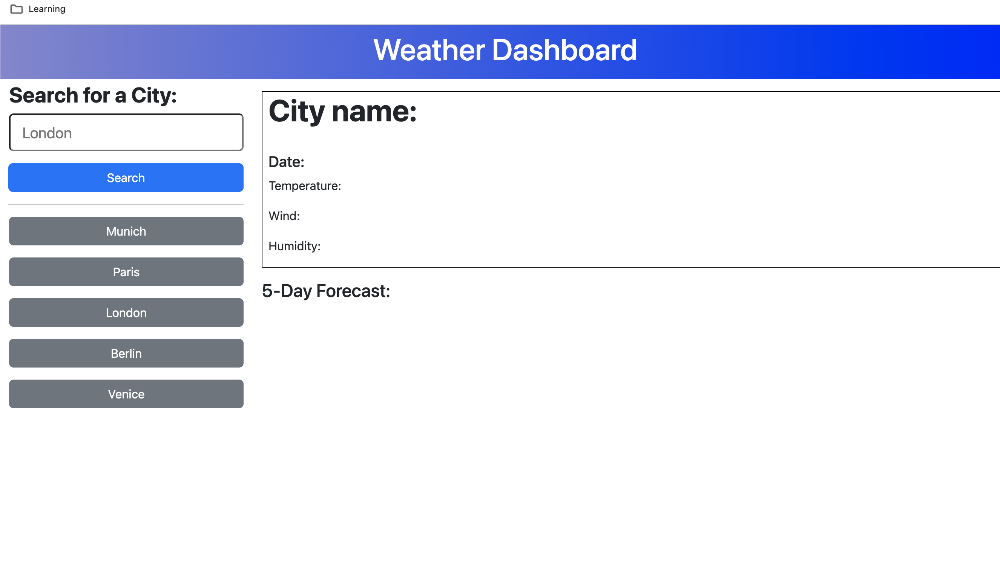
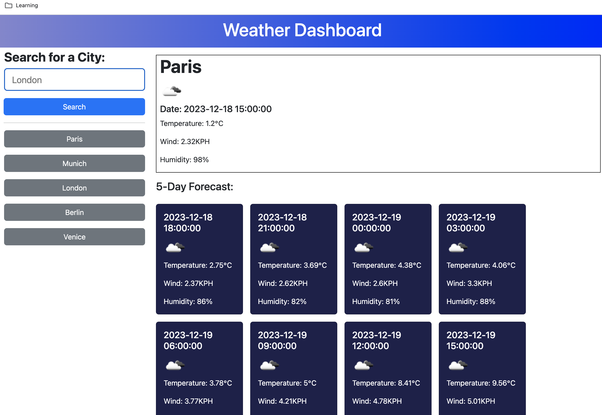
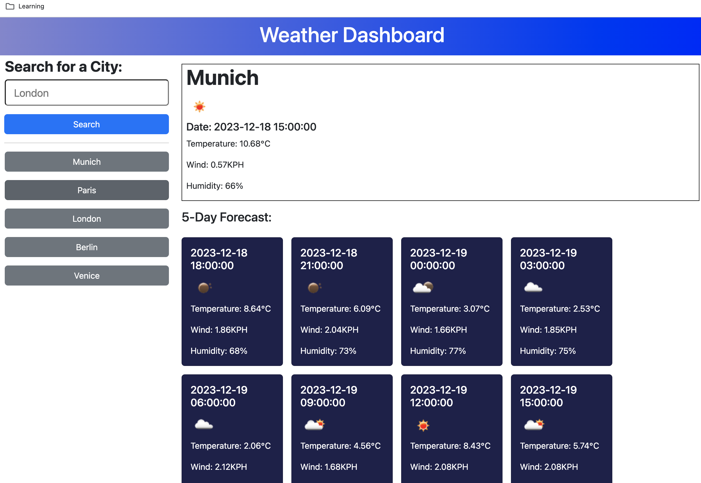
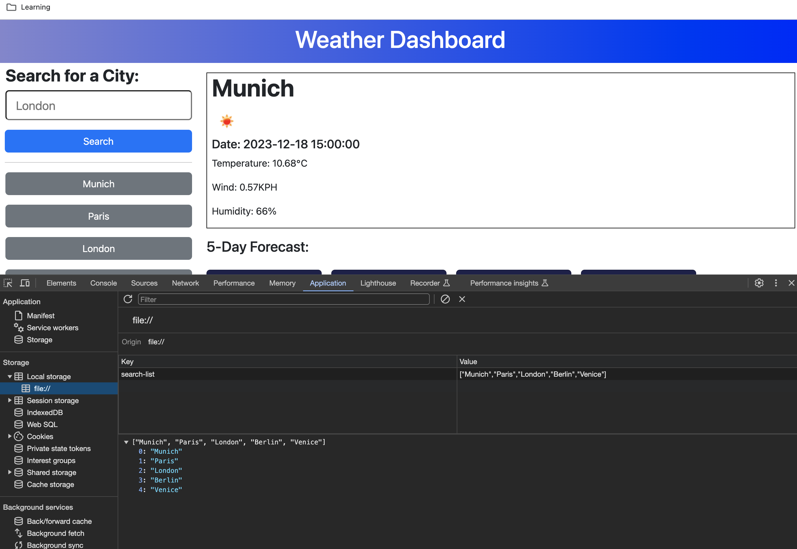

# weather-dashboard

In this challenge I build a weather dashboard that is runing in the browser and feature dynamically updated HTML and CSS.

 ## Table of content

 During this project I worked with the following:

- [Description](#description)
  - [GitHub](#github)
  - [JavaScript](#javascript)
  - [Expected result](#expected-result)
  - [Result of project](#result-of-project)
  - [URLs](#urls)

# Description

For this project I used the Java Script language to create a weather dashboard the following requirements:

  * When a user searches for a city they are presented with current and future conditions for that city and that city is added to the search history.

  * When a user views the current weather conditions for that city they are presented with:
    * The city name
    * The date
    * An icon representation of weather conditions
    * The temperature
    * The humidity
    * The wind speed

  * When a user view future weather conditions for that city they are presented with a 5-day forecast that displays:
    * The date
    * An icon representation of weather conditions
    * The temperature
    * The humidity
    * The wind speed

  * When a user click on a city in the search history they are again presented with current and future conditions for that city.

## GitHub 

I created a new GitHub repo called `weather-dashboard` then executed the following steps:
- git clone
- copy starter file`.html`, create`.js`, `.css` and add a  
   README file

## JavaScript

 I used JavaScript language to create both script.js and worked with:
 - `variables`
 - `loop`:
     - `for` (to be able to iterate through an array).
 - `conditional`:
     - `if` (to perform different actions based on different conditions).
 - `trim` (to remove whitespace from both sides of a string).
 - `.json` (to used when data is sent from a server to a web page).
 -`JSON.parse` (to convert text into a JavaScript object).
 -`JSON.stringhify` (to convert it into a string).
 - `array`
    - `.push` (to add new items to the end of an array).
    - `.unshift` (to add new elements to the beginning of an array).
    - `.slice` (to return selected elements in an array, as a new array).
 - `jQuery methods`: 
     - `.text`(to set the text content of the selected elements). 
     - `.attr` (to add an atribute).
     - `.append`().
     - `.on` (to create an event listener).
     - `.preventDefault` (to cancel the event if it is cancelable, meaning that the default action that belongs to the event will not occur).
     - `.empty` (to removes all ranges from the selection, leaving the anchorNode and focusNode properties equal to null and nothing selected).
     - `.val` (to sets the value attribute of the selected elements).
 - `API call`:
     - `fetch` (to starts the process of fetching a resource from a server).
     - `.then` (to proces API response).
 - `Local Storage`:
     - `.setItem` (to store data like in database by key and be able to retrieve and persist it for later usage).
     - `getItem`(to get the value of the specified local storage item).
     

## Expected result

## Result of project

 
 
 
  

## URLs

* The URL of the deployed application.

https://alinakristy.github.io/weather-dashboard/

* The URL of the GitHub repository. 

https://github.com/alinakristy/weather-dashboard

## License 
Mit License